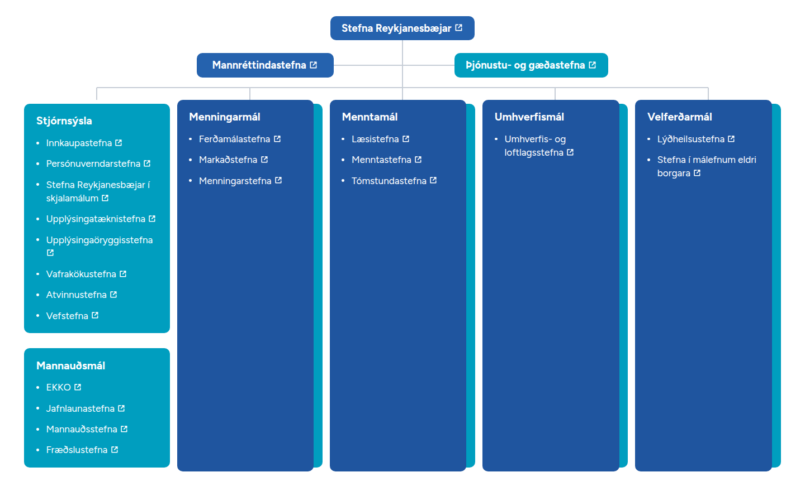

# Stefnurit

Reykjanesbær's **Stefnurit** — the map of the town's policy documents — as a
native, embeddable web component. It replaces the Canva embed, and **the links,
cards and columns are changed by editing one JSON file, not by touching code or
Canva.**



---

## Breyta hlekk — fyrir þau sem skrifa ekki kóða

Allt innihaldið er í einni skrá: **`src/data/stefnurit.json`**.

### Leiðin í gegnum vafrann (einfaldast)

1. Opnaðu skrána beint:
   <https://github.com/Reykjanesbaer/stefnurit/edit/main/src/data/stefnurit.json>
   *(Þessi slóð opnar ritilinn strax. Annars: farðu í `src` → `data` →
   `stefnurit.json` og smelltu á blýantstáknið ✏️ efst til hægri.)*
2. Finndu skjalið sem þú vilt breyta. Leitaðu að heitinu með `Ctrl`+`F` /
   `Cmd`+`F`, t.d. `Vafrakökustefna`.
3. Breyttu slóðinni innan gæsalappanna aftan við `"href":`. **Ekki** fjarlægja
   gæsalappirnar eða kommuna í lok línunnar.
4. Skrunaðu niður, skrifaðu stutta lýsingu á breytingunni og smelltu á
   **Commit changes**.

Síðan uppfærist sjálfkrafa við næstu útgáfu.

### Hvað má breyta

| Reitur | Merking |
|---|---|
| `"label"` | Textinn sem sést. Hér má nota íslenska stafi óhikað. |
| `"href"` | Slóðin á skjalið. Á að byrja á `https://`. Skildu eftir `""` ef enginn hlekkur er til — þá birtist textinn óvirkur. |
| `"kind"` | `"pdf"`, `"page"`, `"external"` eða `"none"`. |
| `"title"` | Fyrirsögn flokks (t.d. `Stjórnsýsla`). |
| `"colorToken"` | `"primary"` (blár), `"accent"` (grænblár) eða `"pill"` (ljósblár). |

Auðkennið `"id"` má ekki vera eins hjá tveimur atriðum — það er notað fyrir
hlekki inn á síðuna.

### Ritstjórnarhamurinn (ef JSON hræðir)

Opnaðu **`demo/edit.html`** í vafra. Þar er sama einingin með hliðarglugga þar
sem þú getur:

- smellt á atriði og breytt texta, hlekk og lit,
- bætt við, eytt, tvöfaldað og dregið til atriði, flokka og dálka,
- séð línurnar endurteiknast um leið,
- skipt á milli **Breitt / Staflað / Sími** til að sjá hvernig þetta lítur út,
- fengið viðvörun ef slóðin er ógild eða ekki `https`,
- smellt á **Sækja JSON** eða **Afrita JSON** og límt niðurstöðuna inn í
  `src/data/stefnurit.json`.

Það sem kemur út er stafrétt eins og skráin sem er í Git, svo breytingin sem
sést í Git er nákvæmlega sú sem þú gerðir — ekkert annað.

Enginn gagnagrunnur, engin innskráning. Drög geymast í vafranum þínum þangað til
þú ýtir á **Núllstilla**.

---

## Embedding it

```html
<script type="module" src="https://…/dist/stefnu-rit.js"></script>

<!-- Reserve the box so the page does not jump while the script loads -->
<style>
  stefnu-rit:not([data-ready]) { display: block; aspect-ratio: 5 / 3; }
  @media (max-width: 1399px) {
    stefnu-rit:not([data-ready]) { aspect-ratio: auto; min-height: 82rem; }
  }
</style>

<stefnu-rit src="https://…/stefnurit.json"></stefnu-rit>
```

Those two shapes are the widget's two layouts. If you add or remove a lot of
content, nudge the `min-height` to match — it is only a placeholder, and the
closer it is the less the page moves on load.

For a CMS that cannot emit `type="module"`, use the IIFE build instead:

```html
<script src="https://…/dist/stefnu-rit.iife.js"></script>
```

**The JSON must be reachable from the page.** Same origin is simplest; from
another origin the server must send `Access-Control-Allow-Origin`. To skip the
fetch entirely, assign the data directly:

```js
document.querySelector('stefnu-rit').config = { /* … */ };
```

### Attributes

| | |
|---|---|
| `src` | URL of the JSON document |
| `target` | link target, `_blank` by default |
| `theme` | `light` (the only theme so far) |
| `.config` | property: render from an object instead of fetching |

The font is built into the bundle, so there is no second request and no CDN to
depend on.

### Restyling without touching the component

Every design value is a CSS custom property. Set any of them on the element, and
they win over both the component's defaults and the `theme` block in the JSON:

```html
<stefnu-rit style="--sr-color-accent: #007E99; --sr-line-color: #B9C2CC"></stefnu-rit>
```

`theme` in the JSON does the same thing for everyone at once:

```jsonc
{ "theme": { "color-accent": "#007E99" } }
```

Token names are in [`src/tokens.js`](src/tokens.js).

---

## The design

The layout started as a reproduction of a Canva file. It is now the project's
own, which is what let a few things that the reproduction forced get fixed:

- **Type no longer shrinks with the widget.** Every length used to be a fraction
  of a fixed 1850 px page, so body text hit its floor well before a tablet. It
  is now fluid between a readable minimum and the size the original used at full
  width: **never below 15 px**, at any width.
- **The column tree stacks at 1400 px**, not 720. Five columns need enough room
  for "Upplýsingaöryggisstefna" to sit on one line, and Chromium ships no
  Icelandic hyphenation patterns, so a narrower column has to break compounds
  mid-syllable. Below that the layout stacks, keeping to a readable measure with
  the connector rail in its own gutter.
- **Column widths are equal.** The first column used to be 4.5 % wider, which
  came from measuring a blurry export, not from a decision.

Colours, the card shapes and the two-cards-in-one-column structure are kept from
the original.

`npm run qa` renders every width and checks what the rules promise — nothing
overflowing its card, nothing below 15 px, connectors landing on the boxes — and
writes the screenshots to [`docs/qa/`](docs/qa/).

### One thing to decide: the teal and WCAG AA

White text on the teal (`#009EBF`) is **3.1 : 1**. AA wants 4.5 : 1 for text this
size, and **13 of the 24 links sit on teal** — all of *Stjórnsýsla* and
*Mannauðsmál*, plus the *Þjónustu- og gæðastefna* pill.

The colour is kept as it is, by decision. Darkening it to `#007E99` clears AA,
is hard to tell apart at normal zoom, and is one line:

```jsonc
{ "theme": { "color-accent": "#007E99" } }
```

`demo/index.html` has a button that toggles it so the two can be compared. The
e2e suite asserts both states: that teal contrast is the only serious axe
finding as shipped, and that the override clears it completely.

As a municipal website this likely falls under the public-sector accessibility
rules, so it is worth revisiting.

---

## Links

All **24 links have a URL — none are empty**, so there is nothing to fill in.
`npm run check-links` verifies they all still resolve:

```
npm run check-links
```

It sends HEAD (falling back to GET for servers that refuse HEAD), prints an
OK / REDIRECT / BROKEN / EMPTY table and exits non-zero if anything is broken,
so it can gate a deploy. `.github/workflows/check-links.yml` runs it weekly and
on any pull request that touches the JSON.

> It has **not** been run against the live site from here — the environment this
> was built in blocks outbound traffic to `www.reykjanesbaer.is`. Run it locally
> once before publishing.

### Defects carried over from the Canva design

Four were fixed simply by moving to one label and one href per item:

- **"Mannauðsstefna" was split across two links.** The final **"a"** pointed at a
  web-archive snapshot of the *Menntastefna* page, so clicking the last letter
  opened the wrong document.
- **"Vefstefna" was not a link at all** — the text was plain and the PDF hung off
  an empty link element beside it.
- Three **stray invisible links** (beside *Markaðstefna*, *EKKO* and
  *Lýðheilsustefna*) pointing at unrelated PDFs.
- A **trailing space** inside "Persónuverndarstefna ".

Three are wording or content decisions and are **left exactly as they are**:

| | |
|---|---|
| **"Markaðstefna"** | The file is `markadsstefna_2023_2028.pdf` and the word is normally *Markaðsstefna*. Looks like a typo. |
| **"Umhverfis- og loftlagsstefna"** | The file is `…loftslagsstefna…` and the word is *loftslagsstefna*. Looks like a typo. |
| **Jafnlaunastefna** | Points at a file dated 8.4.2026 under `/2026/`. Worth confirming it is the current version. |

Change any of them in `src/data/stefnurit.json` whenever you decide.

---

## Development

```
npm install
npm run dev            # demo at localhost:5173
npm test               # unit tests (vitest)
npm run test:e2e       # browser tests (playwright)
npm run build          # dist/stefnu-rit.js + dist/stefnu-rit.iife.js
npm run check-links    # probe every href
npm run qa             # render every width, audit, write screenshots
```

### Layout

```
src/stefnu-rit.js            the web component (single ES module)
src/lines.js                 connector geometry — pure functions
src/validate.js              runtime validation with readable messages
src/tokens.js                every design value, in one place
src/format.js                the one place that decides how the JSON is written
src/data/stefnurit.json      the content — the single source of truth
src/data/stefnurit.schema.json
src/assets/fonts/            Figtree woff2 (SIL OFL 1.1)
demo/index.html              the embed as it will look in production
demo/edit.html               edit mode (not part of the bundle)
demo/bundle.html             loads the built artifacts, so packaging is tested too
docs/design-inventory.md     where the content came from, and what was wrong with it
docs/reference/              the original Canva render, kept as provenance
docs/qa/                     output of npm run qa
scripts/check-links.mjs      link checker
scripts/visual-qa.mjs        width audit and screenshots
```

### How the lines work

There are no cell borders. Every line belongs to one connector tree: a trunk
from the root pill, a branch across to the second-level pills, a rail that spans
exactly the first and last column centres, and one tick down into each column.

None of that geometry is written down. `src/lines.js` takes the rectangles the
browser actually laid out and returns the segments, so adding or removing a
column moves the rail's ends and adds or drops a tick on its own. Abutting runs
are merged, so a join never shows a seam or a doubled stroke. Below the stacking
width the same module routes a single vertical rail with a tick into each card.
The connectors are redrawn on resize and again once the webfont has swapped in.

### Where this departs from the original brief

- **Semantics.** The brief asked for `role="table"` with rows and cells. The
  content is a navigation tree of documents, not tabular data, and a table role
  makes a screen reader announce "table, 5 rows" and offer cell navigation
  across what are visually columns. It is built as `<nav>` with headed lists
  instead, which reads correctly.
- **Data model.** The brief's `sections → rows → items` became
  `sections → columns → cards → items`, because that is the shape of the
  content: five columns, the first holding two stacked cards.
- **The GitHub screenshot** the brief asked for is a direct deep link instead —
  it does not go stale when GitHub moves its buttons.
- **Pixel-fidelity QA against the Canva export** has been dropped along with the
  dependency on that file. `npm run qa` checks the layout's own rules instead.

---

## Licence

Code: MIT. Figtree: SIL Open Font License 1.1. The policy documents themselves
belong to Reykjanesbær.
